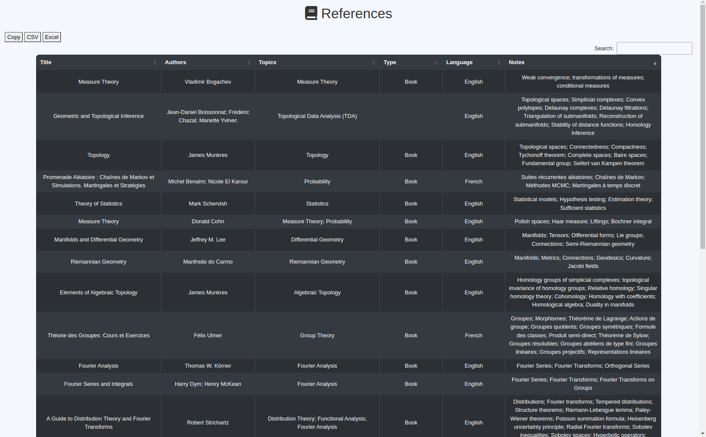

# 📚 My Library

As my collection of references grew, it became increasingly difficult to locate specific information. I created this tagged reference database to help quickly search for books, articles, and other resources using keywords. It allows faster and more efficient access to relevant references.

The database is powered by **SQLite**.

## 🖥️ Preview



## 📘 Content of the database

The database contains mainly references related to **mathematics** and **computer science**. If your interests lie elsewhere, this might not be the most relevant resource (sorry!). However, you are welcome to adapt it for your needs. Simply use your own references and follow the steps in [Make Your Own Database](#🔧-make-your-own-database) to generate your own table.

## 🔧 Make your own database

You can fork this repository and edit the database using your favourite tool. Personally, I use [sqlite browser](https://sqlitebrowser.org/). To generate the HTML table, simply run the following command:

```{bash}
python3 update.py
```
